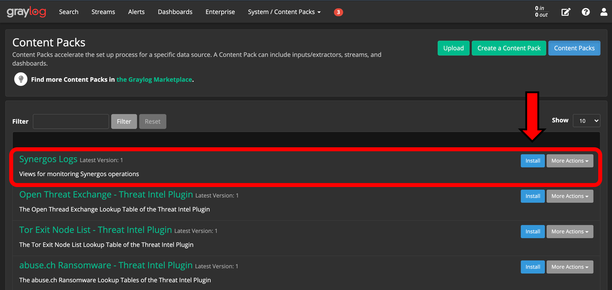
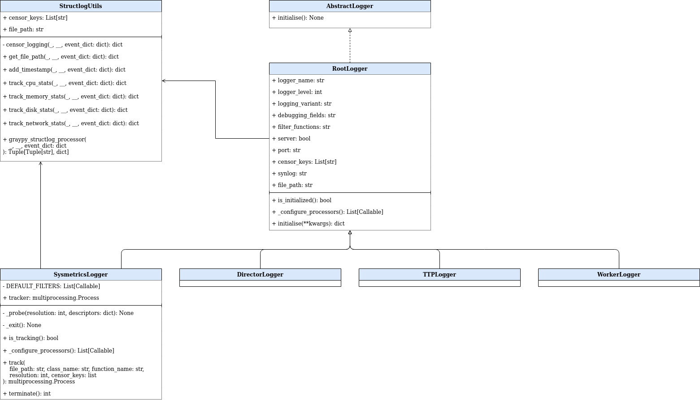

# Synergos Logger

Logging component of the Synergos network

*Component repositories of Synergos [V3]*

The Synergos grid prides itself on its modular system of deployment, comprizing various deployment combinations as seen from the diagram above. General configurations are as follows:
1. **`Synergos Basic`** 
    > Simplest deployment pattern, consisting a duet of 2 containers - *Synergos-TTP* & *Synergos-Worker*. 
2. **`Synergos Plus`**
    > Intermediate deployment pattern that equips the grid with the capability to for metadata extraction/analysis. This allows users to gain access to hardware statistics, data-cataloguing, lineage tracking and general centrialised logging.
3. **`Synergos Cluster`**
    > Full distributed deployment pattern with job queue integration in addition to metadata extraction. This configuration is optimized for running concurrent federated cycles to facilitate hyperparameter tuning.

By having users install different components depending on their supposed role within the federated grid, most of the complexity associated with federated orchestrations are obscured completely from the users. Specifically, the goal is to stitch entire containers together with unique Dockerfile configurations.

This repository governs **Synergos Logger**, the primary logging component of the Synergos network `SynCluster` configuration.

---

## Installation
As Synergos is still under development, its components have yet to be deployed on PyPi. Hence, the best way to use Synergos Logger is to install it in development mode in a local virtualenv.

```
# Download source repository
git clone https://github.com/aimakerspace/synergos_logger.git
cd ./synergos_logger

# Setup virtual environment
conda create -n synergos_env python=3.7

# Install in development mode
pip install -e .
```
---

## How to use?

*Usage orchestration of Synergos Logger*

While many alternatives for centrialised logging exist, we have decided on Graylog as current selection due to its extensive documentations, community support and industrial integrations. In a distributed system, such a logging service is invaluable

As seen from the diagram above, we first need to launch a customised logging server. This is a pre-configured Graylog network, equipped with:

1) 4 TCP input channels
    - `Sysmetrics Logs` on port `9100`
    - `Director Logs` on port `9200`
    - `TTP Logs` on port `9300`
    - `Worker Logs`on port `9400`
2) 4 Streams:
    - `Sysmetric Stream` - filtering for `SYS_` loggers
    - `Director Stream` - filtering for `DIR_` loggers
    - `TTP Stream` - filtering for `TTP_` loggers
    - `Worker Stream` - filtering for `WKR_` loggers
3) Unified Dashboard
    - `Sysmetrics Analysis` 
    - `Director Analysis` 
    - `TTP Analysis` 
    - `Worker Analysis` 

More information on the procedure can be found [here](https://gitlab.int.aisingapore.org/aims/federatedlearning/fedlearn-prototype/-/wikis/Developer-Guides/Federated-Learning-A-Developer's-Diary). 

Starting the customised Graylog network is simple: 

```
# Build customised Graylog instance as a container network
docker-compose up
```

Once the Graylog network is started and running, login and navigate to `Content Packs`.


Install the `Synergos Logs` content pack. ThiS will pre-configure all Synergos settings for compatibility right out the box.



Verify that all configurations have been properly installed. You should be able to see these configurations in their respective sections.


### A. General Logging

For general logging to Graylog, each party should use an appropriate logger in accordance to the role that the component undertakes:

1. Director uses `DirectorLogger`
2. TTPs uses `TTPLogger`
3. Workers uses `WorkerLogger`

```
import os
import sys
from synlogger.general import TTPLogger

##################
# Log Submission #
##################

# Specify Graylog's Host
graylog_host = "127.0.0.1"  # or IP of VM hosting Graylog instance

# Configure your logger
logger_name = "test_logger"    # unique ID to represent logger's device
logging_level = logging.INFO   # logging level of messages to capture
logging_variant = "graylog"    # type of logging backend to configure
debugging_fields = False       # toggles existence of debug fields
filter_functions = []          # filters to be used for logging

# Instantiate your logger
ttp_logger = TTPLogger(
    server=graylog_host,
    logger_name=logger_name,
    logging_level=logging_level,
    logging_variant=logging_variant,
    debugging_fields=debugging_fields,
    filter_functions=filter_functions
)

# Initialise your logger
syn_logging = ttp_logger.initialise()

# Log your message
syn_logging.info("Hello World!", owner="me")
```

You should see this message logged over on `TTP Logs` on the Graylog server.


Here's a realworld application:

In some script `/path/to/test_script.py`,

```
class TestClass:

    def test_function(self, ...):

        try:
            ...

        except:

            # Here's a realworld application!
            file_path = os.path.abspath(__file__)           # file where log was called
            class_name = TestClass.__name__                 # class where log was called
            function_name = sys._getframe().f_code.co_name  # function where log was called
            syn_logging.error(
                "ValueError: Specified criterion is currently not supported!", 
                file_path=file_path         # "/path/to/test_script.py"
                Class=class_name            # "TestClass"
                function_name=function_name # "test_function"
            )
```

### B. Sysmetric Logging

Sysmetric logging involves automated probing of a party's system metadata, at some defined interval.

```
from synlogger.general import SysmetricLogger

########################
# Sysmetric Submission #
########################

# Specify Graylog's Host
graylog_host = "127.0.0.1"  # or IP of VM hosting Graylog instance

# Configure your logger
logger_name = "test_logger"    # unique ID to represent logger's device
logging_level = logging.INFO   # logging level of messages to capture
logging_variant = "graylog"    # type of logging backend to configure
debugging_fields = False       # toggles existence of debug fields
filter_functions = []          # filters to be used for logging

# Instantiate your logger
sysmetric_logger = SysmetricLogger(
    server=graylog_host,
    logger_name=logger_name,
    logging_level=logging_level,
    logging_variant=logging_variant,
    debugging_fields=debugging_fields,
    filter_functions=filter_functions
)

# Commence sysmetric tracking
sysmetric_logger.track(
    file_path="test_path", 
    class_name="TestClass", 
    function_name="test_function"
)

.
.
.

# Terminate sysmetric tracking
sysmetric_logger.terminate()
```

You should see this message logged over on `Sysmetrics Logs` on the Graylog server.


---

## Further Documentations
For now, documentations are still in progress. In the meantime, use python's `help()` function to find out existing parameters to each of the task classes. 

*Interfacing components that make up the Synergos Manager package*

Alternatively, you may refer to the UML class diagram above for the list of functions supported for each component class.

For more information on how to use Graylog in the context of Synergos, please refer to [this guide](https://gitlab.int.aisingapore.org/aims/federatedlearning/fedlearn-prototype/-/wikis/Centralized-logging-for-Synergos).